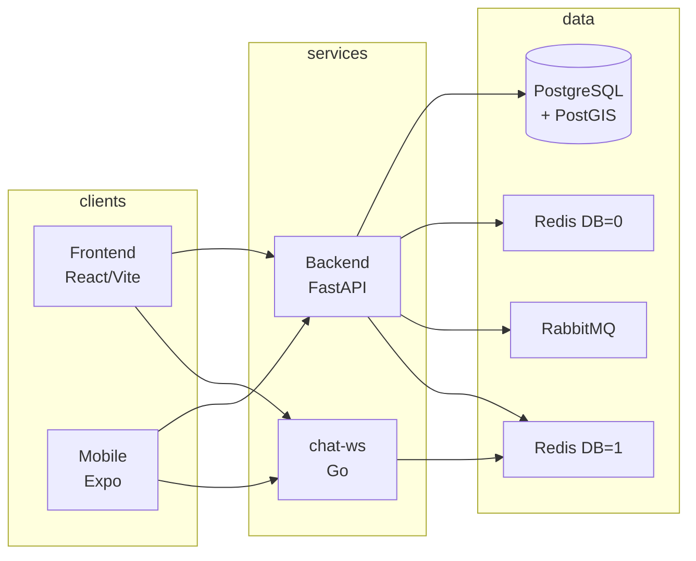

# Linkup — Ride-Sharing Platform

A full-stack ride-sharing application where drivers post rides, passengers search and book, and real-time chat with AI-powered conversation summaries keeps everyone in sync.

---

## What Linkup Does

Linkup connects drivers and passengers for shared rides. Drivers publish trips with origin, destination, date, and available seats. Passengers search, send booking requests, and get approved or rejected by drivers. Once a booking is confirmed, driver and passenger chat in real time over WebSocket. When a conversation ends, an AI pipeline (Groq / Llama) analyzes the chat and sends an email summary. The app supports Google OAuth and email/password login, profile avatars (S3), geo routing and distance calculation, and push, email, and in-app notifications—all backed by an outbox pattern for reliable event delivery.

---

## Architecture



- **Frontend / Mobile** → REST to backend, WebSocket to chat-ws.  
- **Backend** → PostgreSQL (data), Redis DB=0 (cache, rate limit, outbox worker), Redis DB=1 (chat completion events), RabbitMQ (async tasks, notifications).  
- **chat-ws** → Redis DB=1 only (subscribe to chat channels, fan out to connected clients).

---

## Services

| Service   | Language        | Role |
|----------|------------------|------|
| backend  | Python (FastAPI) | REST API, auth, rides, bookings, chat CRUD, AI summary (Celery), notifications, outbox worker |
| chat-ws  | Go               | WebSocket server; real-time message delivery only (no business logic) |
| frontend | React / TypeScript | Web app (Vite); Hebrew RTL |
| mobile   | React Native / Expo | Mobile app (TypeScript) |

---

## Tech Stack

| Category      | Technologies |
|---------------|--------------|
| **Backend**   | Python, FastAPI, PostgreSQL, PostGIS, SQLAlchemy (async), Alembic, Redis, RabbitMQ, Celery, Firebase (FCM), S3, Groq (AI) |
| **Real-time** | Go (chat-ws), Redis Pub/Sub |
| **Frontend**  | React, TypeScript, Vite, Google Maps |
| **Mobile**    | React Native, Expo, TypeScript |
| **Infrastructure** | Docker, Docker Compose, Kubernetes (manifests in repo) |
| **Cloud / CI**| Render, GitHub Actions (backend, chat-ws, frontend) |

---

## Key Features

- ✅ Ride search, booking requests, and driver approve/reject
- ✅ Real-time chat (WebSocket) between driver and passenger
- ✅ AI conversation summary (Groq / Llama) and email on chat end
- ✅ Push (FCM), email (Brevo), and in-app notifications
- ✅ Google OAuth and email/password auth with JWT + refresh
- ✅ Geo: distance, route display, PostGIS-backed queries
- ✅ Profile and avatar upload (S3)
- ✅ Outbox pattern for reliable event publishing to RabbitMQ
- ✅ Kubernetes-ready (manifests in `k8s/`)

---

## Getting Started

**Prerequisites:** Docker, Docker Compose.

```bash
git clone <repository-url>
cd Linkup
```

Create environment files (see `backend/.env.example`, `frontend/.env.example`, `chat-ws/.env.example` for required variables):

```bash
cp backend/.env.example backend/.env
cp frontend/.env.example frontend/.env
cp chat-ws/.env.example chat-ws/.env
# Edit *.env and set secrets (DB, Redis, RabbitMQ, JWT, Brevo, Google, Groq, S3, Firebase, etc.)
```

For local development with hot-reload:

```bash
cp docker-compose.override.yml.example docker-compose.override.yml
```

Start the stack:

```bash
docker compose up --build
```

- **API:** <http://localhost:8000> — Docs: <http://localhost:8000/docs>  
- **Frontend:** run separately with `cd frontend && npm install && npm run dev` (or add to compose)  
- **Chat WebSocket:** <ws://localhost:8081/ws?token=JWT>

Apply the database schema once (see `db/schema.sql`) and run migrations: `cd backend && alembic upgrade head`.

---

## Project Structure

| Folder      | Description |
|------------|-------------|
| `backend/` | FastAPI app: API, domain logic, workers (outbox, notifications, chat completion listener), Alembic migrations |
| `chat-ws/` | Go WebSocket server: Redis subscribe, JWT auth, message fan-out to clients |
| `frontend/`| React (Vite) web app; Dockerfile + nginx.conf for production build |
| `mobile/`  | React Native (Expo) app |
| `k8s/`     | Kubernetes base, backend, chat-ws, frontend, infra (Postgres, Redis, RabbitMQ) |
| `db/`      | Reference schema (`schema.sql`) and utility scripts; migrations live in `backend/alembic/` |
| `docs/`    | Architecture and operational notes |

---

## Architecture Decisions

- **Go for chat-ws (not Python).** WebSocket servers benefit from low per-connection overhead and high concurrency. Go’s goroutines and small footprint fit many idle connections; the service does no DB or business logic—only subscribe to Redis and push to clients. Keeping it in Go avoids pulling the full Python stack into the real-time path.

- **Redis DB separation (DB=0 vs DB=1).** Backend uses Redis for cache, rate limiting, and outbox-related state on DB=0. Chat traffic (pub/sub for messages and completion events) uses DB=1 so that chat-ws and the backend’s chat-completion listener can share the same Redis instance without key or namespace clashes and without backend cache evictions affecting chat.

- **Celery (in backend) for AI chat summary (not a separate service).** The AI flow is “on conversation end, analyze and persist.” That fits a background task in the same process that already has the domain logic and DB access. A dedicated microservice would duplicate models, config, and deployment surface. The backend publishes a completion event to Redis DB=1; the outbox worker (same codebase) subscribes and runs the existing `handle_conversation_completion` logic. One less service to deploy and monitor.

- **Outbox pattern.** Notifications (email, push) and other side effects are triggered by domain events. Publishing directly to RabbitMQ in the same transaction as the DB write would risk losing events on crash or broker failure. Writing the event to an `outbox_events` table in the same transaction, then having a worker poll and publish to RabbitMQ, keeps “at-least-once” delivery and keeps the API response fast and independent of broker latency.

---

## CI/CD

- **Backend:** GitHub Actions — lint (Ruff), tests (pytest). Workflow: `.github/workflows/backend-ci.yml`.
- **chat-ws:** GitHub Actions — dependency download, build, vet. Workflow: `.github/workflows/chat-ws-ci.yml`.
- **Frontend:** GitHub Actions — install, lint, build. Workflow: `.github/workflows/frontend-ci.yml`.

Production-style deployment is defined in `render.yaml` (Render) and in `k8s/` for Kubernetes.
